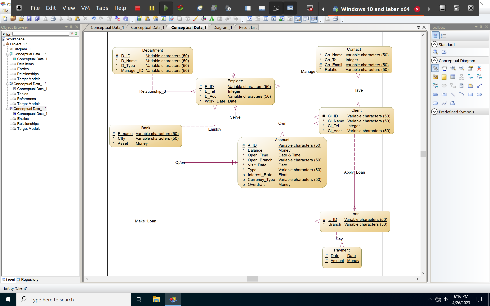
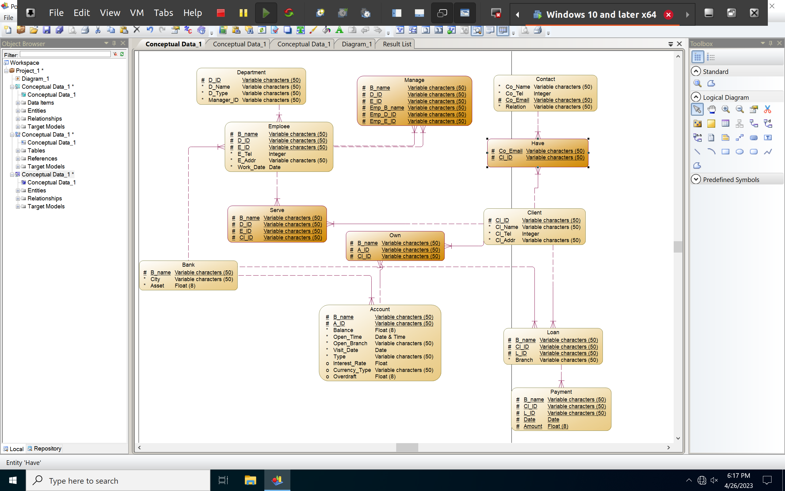
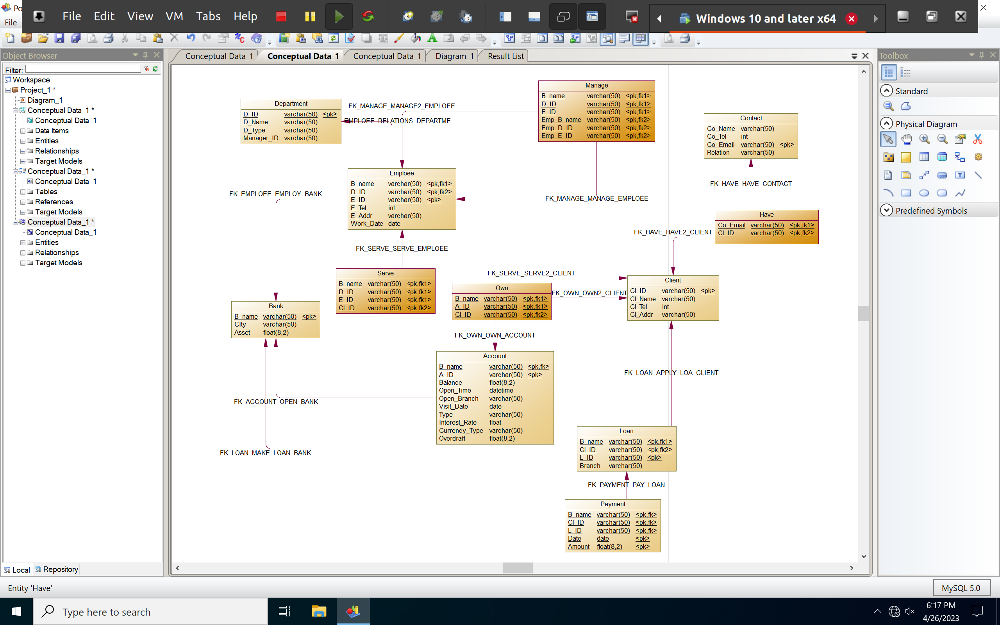

# 银行业务管理系统数据库设计

>PB20111712 郭耸霄

[TOC]

## 概念模式设计

### 实体设计

| 实体名称 |                             属性                             |
| :------: | :----------------------------------------------------------: |
|   支行   |                       城市，名字，资产                       |
|   客户   |              身份证号，姓名，联系电话，家庭住址              |
|  联系人  |     联系人姓名，联系人手机号，联系人Email，与客户的关系      |
|   员工   |      身份证号，姓名，电话号码，家庭住址，开始工作的日期      |
|   部门   |        部门号，部门名称，部门类型，部门经理的身份证号        |
|   账户   | 账户号，余额，开户日期，开户的支行名，访问该账户的最近日期，利率，货币类型，透支额 |
|   贷款   |                       贷款号，分支机构                       |
|   付款   |                          日期，金额                          |

### 联系设计

| 联系名称 | 联系类型 |        联系成员        |
| :------: | :------: | :--------------------: |
|   从属   |  一对多  |       员工，部门       |
|   领导   |  一对多  | 员工（部门经理），员工 |
|   服务   |  多对多  |       员工，客户       |
|   对应   |  多对多  |      用户，联系人      |
|   雇佣   |  一对多  |       支行，员工       |
|   开设   |  一对多  |       银行，账户       |
|   发放   |  一对多  |       银行，贷款       |
|   支付   |  一对多  |       贷款，付款       |
|   借贷   |  一对多  |       用户，贷款       |
|   拥有   |  多对多  |       客户，账户       |

### Power Designer 的 ER 图

基于前述分析，利用 Power Designer 设计了银行业务管理系统的数据库概念模型，结果如图所示。

## 概念模型到逻辑模型的转换

### 实体转换

<u>下划线</u>表示主键，*斜体*表示外键。

| 实体名称 |                             属性                             |
| :------: | :----------------------------------------------------------: |
|   支行   |                   城市，<u>名字</u>，资产                    |
|   客户   |          <u>身份证号</u>，姓名，联系电话，家庭住址           |
|  联系人  |  联系人姓名，联系人手机号，<u>联系人Email</u>，与客户的关系  |
|   员工   | <u>身份证号</u>，姓名，电话号码，家庭住址，开始工作的日期，*<u>支行名字</u>*，*<u>部门号</u>* |
|   部门   |    <u>部门号</u>，部门名称，部门类型，部门经理的身份证号     |
|   账户   | <u>账户号</u>，余额，开户日期，*开户的支行名*，访问该账户的最近日期，利率，货币类型，透支额 |
|   贷款   |             <u>贷款号</u>，*分支机构*，*客户号*              |
|   付款   |   <u>日期</u>，<u>金额</u>，*分支机构*，*贷款号*，*客户号*   |

### 联系转换

将多对多联系转换成实体。所有属性值均为主键也均为外键。

| 名称 |                             属性                             |
| :--: | :----------------------------------------------------------: |
| 服务 |               支行名称，部门号，员工号，客户号               |
| 领导 | 员工支行名称，员工部门号，员工员工号，经理支行名称，经理部门号，经理员工号 |
| 拥有 |                   支行名称，账户号，客户号                   |
| 对应 |                     客户号，联系人Email                      |

### 最终的关系模式

## MySQL 数据库结构实现

### Power Designer 的 PDM 设计

### 数据库表的定义

Power Designer 的 PDM 可以直接转换为 MySQL 中的基本表。下面给出了基于 PDM 构建的 MySQL 基本表设计结果。

- Bank

|  列名  |   中文含义   | 类型(长度)  | 允许为空 | 是否主键 | 是否外键（给出表名列名） |
| :----: | :----------: | :---------: | :------: | :------: | :----------------------: |
| B_name |   支行名称   | varchar(50) |    N     |    Y     |            N             |
|  City  | 支行所在城市 | varchar(50) |    N     |    N     |            N             |
| Asset  |   支行资产   | float(8,2)  |    N     |    N     |            N             |

- Department

|    列名    |  中文含义  | 类型(长度)  | 允许为空 | 是否主键 | 是否外键（给出表名列名） |
| :--------: | :--------: | :---------: | :------: | :------: | :----------------------: |
|    D_ID    |   部门号   | varchar(50) |    N     |    Y     |            N             |
|   D_Name   |  部门名称  | varchar(50) |    N     |    N     |            N             |
|   D_Type   |  部门类型  | float(8,2)  |    N     |    N     |            N             |
| Manager_ID | 经理员工号 | varchar(50) |    N     |    N     |      Employee.E_ID       |

- Employee

|   列名    |   中文含义   | 类型(长度)  | 允许为空 | 是否主键 | 是否外键（给出表名列名） |
| :-------: | :----------: | :---------: | :------: | :------: | :----------------------: |
|  B_name   |   支行名称   | varchar(50) |    N     |    Y     |       Bank.B_name        |
|   D_ID    |    部门号    | varchar(50) |    N     |    Y     |     Department.D_ID      |
|   E_ID    |    员工号    | varchar(50) |    N     |    Y     |            N             |
|   E_Tel   |    电话号    |     int     |    N     |    N     |            N             |
|  E_Addr   |     地址     | varchar(50) |    N     |    N     |            N             |
| Work_Date | 工作开始日期 |    date     |    N     |    N     |            N             |

- Client

|  列名   |  中文含义  | 类型(长度)  | 允许为空 | 是否主键 | 是否外键（给出表名列名） |
| :-----: | :--------: | :---------: | :------: | :------: | :----------------------: |
|  Cl_ID  |   客户号   | varchar(50) |    N     |    Y     |            N             |
| Cl_Name |  客户名称  | varchar(50) |    N     |    N     |            N             |
| Cl_Tel  | 客户电话号 |     int     |    N     |    N     |            N             |
| Cl_Addr |  客户地址  | varchar(50) |    N     |    N     |            N             |

- Contact

|   列名   |   中文含义   | 类型(长度)  | 允许为空 | 是否主键 | 是否外键（给出表名列名） |
| :------: | :----------: | :---------: | :------: | :------: | :----------------------: |
| Co_Name  |  联系人名字  | varchar(50) |    N     |    Y     |            N             |
|  Co_Tel  |  联系人电话  |     int     |    N     |    N     |            N             |
| Co_Email | 联系人 Email | varchar(50) |    N     |    Y     |            N             |
| Relation | 与客户的关系 | varchar(50) |    N     |    N     |            N             |

- Account

|     列名      | 中文含义 | 类型(长度)  | 允许为空 | 是否主键 | 是否外键（给出表名列名） |
| :-----------: | :------: | :---------: | :------: | :------: | :----------------------: |
|    B_name     | 支行名称 | varchar(50) |    N     |    Y     |       Bank.B_name        |
|     A_ID      |  账户号  | varchar(50) |    N     |    Y     |            N             |
|    Balance    |   余额   | float(8,2)  |    N     |    N     |            N             |
|   Open_Time   | 开户时间 |    date     |    N     |    N     |            N             |
|  Visit_Date   | 访问日期 |    date     |    N     |    N     |            N             |
|     Type      | 账户类型 | varchar(50) |    N     |    N     |            N             |
| Interest_Rate |   利率   |    float    |    Y     |    N     |            N             |
| Currency_Type | 货币类型 | varchar(50) |    Y     |    N     |            N             |
|   Overdraft   |   额度   |    float    |    Y     |    N     |            N             |

- Loan

|  列名  | 中文含义 | 类型(长度)  | 允许为空 | 是否主键 | 是否外键（给出表名列名） |
| :----: | :------: | :---------: | :------: | :------: | :----------------------: |
| B_name | 支行名称 | varchar(50) |    N     |    Y     |       Bank.B_name        |
| Cl_ID  |  客户号  | varchar(50) |    N     |    Y     |       Client.Cl_ID       |
|  L_ID  |  贷款号  | varchar(50) |    N     |    Y     |            N             |

- Payment

|  列名  | 中文含义 | 类型(长度)  | 允许为空 | 是否主键 | 是否外键（给出表名列名） |
| :----: | :------: | :---------: | :------: | :------: | :----------------------: |
| B_Name | 支行名称 | varchar(50) |    N     |    Y     |       Bank.B_Name        |
| Cl_ID  |  客户号  | varchar(50) |    N     |    Y     |       Client.Cl_ID       |
|  L_ID  |  贷款号  | varchar(50) |    N     |    Y     |        Loan.L_ID         |
|  Date  | 付款日期 |    date     |    N     |    Y     |            N             |
| Amount |   金额   | float(8,2)  |    N     |    Y     |            N             |

- Manage

|    列名    |     中文含义     | 类型(长度)  | 允许为空 | 是否主键 | 是否外键（给出表名列名） |
| :--------: | :--------------: | :---------: | :------: | :------: | :----------------------: |
|   B_name   | 员工所在支行名称 | varchar(50) |    N     |    Y     |       Bank.B_name        |
|    D_ID    |  员工所在部门号  | varchar(50) |    N     |    Y     |     Department.D_ID      |
|    E_ID    |    员工员工号    | varchar(50) |    N     |    Y     |      Employee.E_ID       |
| Emp_B_name | 经理所在支行名称 | varchar(50) |    N     |    Y     |       Bank.B_name        |
|  Emp_D_ID  |  经理所在部门号  | varchar(50) |    N     |    Y     |     Department.D_ID      |
|  Emp_E_ID  |    经理员工号    | varchar(50) |    N     |    Y     |      Employee.E_ID       |

- Serve

|  列名  | 中文含义 | 类型(长度)  | 允许为空 | 是否主键 | 是否外键（给出表名列名） |
| :----: | :------: | :---------: | :------: | :------: | :----------------------: |
| B_name | 支行名称 | varchar(50) |    N     |    Y     |       Bank.B_name        |
|  D_ID  |  部门号  | varchar(50) |    N     |    Y     |     Department.D_ID      |
|  E_ID  |  员工号  | varchar(50) |    N     |    Y     |      Employee.E_ID       |
| Cl_ID  |  客户号  | varchar(50) |    N     |    Y     |       Client.Cl_ID       |

- Have

|   列名   |    中文含义    | 类型(长度)  | 允许为空 | 是否主键 | 是否外键（给出表名列名） |
| :------: | :------------: | :---------: | :------: | :------: | :----------------------: |
| Co_Email | 联系人电子邮件 | varchar(50) |    N     |    Y     |     Contact.Co_Email     |
|  Cl_ID   |     客户号     | varchar(50) |    N     |    Y     |       Client.Cl_ID       |

- Own

|  列名  | 中文含义 | 类型(长度)  | 允许为空 | 是否主键 | 是否外键（给出表名列名） |
| :----: | :------: | :---------: | :------: | :------: | :----------------------: |
| B_name | 支行名称 | varchar(50) |    N     |    Y     |       Bank.B_name        |
|  A_ID  |  账户号  | varchar(50) |    N     |    Y     |       Account.A_ID       |
| Cl_ID  |  客户号  | varchar(50) |    N     |    Y     |       Client.Cl_ID       |

## 总结与体会

本报告给出了利用 Power Designer 进行一个银行业务管理系统数据库的基本过程，包括概念模型设计、概念模型到逻辑模型的转换以及最终的 MySQL 数据库结构实现。

Power Designer 软件没有 Linux 版本，对于使用 Linux 系统的同学十分不友好。建议可以改进使用开源软件代替它。
