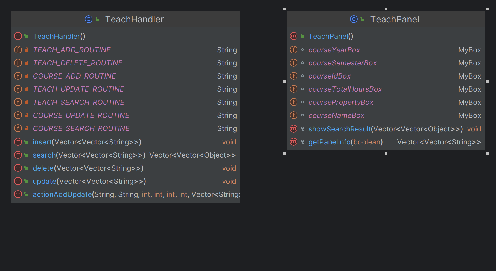

> 教师教学科研登记系统-系统设计与实现报告
>
> 郭耸霄 PB20111712
>
> 计算机科学与技术学院 中国科学技术大学 2023 年 6 yue

[TOC]

# 1 概述

## 1.1 系统目标

本系统旨在为教师提供一个方便的教学科研登记平台，以便于记录和管理教师的教学科研工作情况，提高教师工作效率和管理水平。

## 1.2 需求说明

本系统主要包含四个模块：论文登记、项目登记和课程登记，以及一个查询统计模块。其中，论文登记模块包括论文发表信息的增、删、改、查功能，要求输入时检查通讯作者和作者排名的重复，以及论文类型和级别的正确性；项目登记模块包括项目信息的增、删、改、查功能，要求输入时检查排名的重复和经费的正确性；课程登记模块包括主讲课程信息的增、删、改、查功能，要求输入时检查主讲学时总额和课程总学时的一致性。查询统计模块包括按教师工号和给定年份范围汇总查询该教师的教学科研情况的功能，以及按教师工号和给定年份范围生成教学科研工作量统计表并导出文档的选做功能。

## 1.3 本报告的主要贡献

本报告提供了一个面向教师的教学科研登记系统的设计方案，包括系统目标、需求说明和主要功能模块的描述。本报告还强调了数据之间的一致性和出错处理的重要性，提醒开发者在设计和实现过程中要注意这些方面。本报告还提供了一些具体的实现建议，例如选择 MySQL 作为后台 DBMS，考虑使用 Java 开发前端。最后，本报告提供了一个灵活的查询功能的要求，以满足用户多样化的查询需求。

# 2 总体设计

## 2.1 系统模块结构

```bash
C:.
└─jeffrey
    └─trrs
        ├─commit
        │      CommitHandler.java	#项目承担情况后端处理类
        │      CommitPanel.java		#项目承担情况前端界面类
        │      DataBase.sql			#项目承担情况数据库操作脚本
        │      
        ├─enums						#系统中使用的枚举类
        │      CourseProperty.java
        │      Gender.java
        │      PaperLevel.java
        │      PaperType.java
        │      ProjectType.java
        │      Semester.java
        │      TeacherTitle.java
        │      
        ├─main
        │      drop.sql			    #测试使用的清除数据脚本
        │      InsertData.sql		#测试使用的插入数据脚本
        │      MainFrame.java        #主界面类
        │      teacher.sql			#建立教师表数据库脚本
        │      
        ├─publish
        │      DataBase.sql			#论文发表情况数据库脚本
        │      PublishHandler.java   #论文发表情况后端处理类
        │      PublishPanel.java     #论文发表情况前端界面类
        │      
        ├─search
        │      SearchHandler.java    #查询统计后端处理类
        │      SearchPanel.java      #查询统计前端界面类
        │      
        ├─teach
        │      DataBase.sql          #主讲课程情况数据库脚本
        │      TeachHandler.java     #主讲课程情况后端处理类
        │      TeachPanel.java       #主讲课程情况前端界面类
        │      
        └─utilities
                DatabaseConnector.java    #后端处理类的父类
                MyBox.java				 #前端界面使用的重要小组件类
                SubPanel.java             #前端界面类的父类
```

## 2.2 系统工作流程


## 2.3 数据库设计

### 2.3.1 E-R 图


### 2.3.1 存储过程

#### 2.3.1.1 发表论文相关

##### 2.3.1.1.1 添加论文

```sql
DELIMITER //
DROP PROCEDURE IF EXISTS paperAdd;
CREATE PROCEDURE paperAdd(
    IN paperId INTEGER,
    IN paperTitle CHARACTER(255),
    IN paperSource CHARACTER(255),
    IN paperYear INTEGER,
    IN paperType INTEGER,
    IN paperLevel INTEGER
)
BEGIN
    DECLARE s INTEGER DEFAULT 0;

    IF NOT EXISTS (SELECT * FROM paper WHERE id = paperId) THEN
        INSERT INTO paper VALUES (paperId, paperTitle, paperSource, paperYear, paperType, paperLevel);
    ELSE
        IF NOT EXISTS (SELECT *
                       FROM paper
                       WHERE id = paperId
                         AND title = paperTitle
                         AND source = paperSource
                         AND year = paperYear
                         AND type = paperType) THEN
            SET s = 1;
        END IF;
    END IF;

    IF s = 1 THEN
        SIGNAL SQLSTATE '45000' SET MESSAGE_TEXT = '该论文已存在，但信息不匹配。';
    END IF;
END //
DELIMITER ;
```

##### 2.3.1.1.2 更改论文

```sql
DELIMITER //
DROP PROCEDURE IF EXISTS paperUpdate;
CREATE PROCEDURE paperUpdate(
    IN paperId INTEGER,
    IN paperTitle CHARACTER(255),
    IN paperSource CHARACTER(255),
    IN paperYear INTEGER,
    IN paperType INTEGER,
    IN paperLevel INTEGER
)
BEGIN
    DECLARE s INTEGER DEFAULT 0;

    IF NOT EXISTS (SELECT * FROM paper WHERE id = paperId) THEN
        SET s = 1;
    ELSE
        IF NOT EXISTS (SELECT *
                       FROM paper
                       WHERE id = paperId
                         AND title = paperTitle
                         AND source = paperSource
                         AND year = paperYear
                         AND type = paperType) THEN
            UPDATE paper
            SET title  = paperTitle,
                source = paperSource,
                year   = paperYear,
                type   = paperType,
                level  = paperLevel
            WHERE id = paperId;
        END IF;
    END IF;

    IF s = 1 THEN
        SIGNAL SQLSTATE '45001' SET MESSAGE_TEXT = '该论文不存在，无法更新。';
    END IF;
END //
DELIMITER ;
```

##### 2.3.1.1.3 添加论文发表情况

```sql
DELIMITER //
DROP PROCEDURE IF EXISTS publishAdd;
CREATE PROCEDURE publishAdd(
    IN paperId INTEGER,
    IN teacherId CHARACTER(5),
    IN publishRanking INTEGER,
    IN publishIsCorrespondingAuthor BOOLEAN,
    IN publishRank INTEGER
)
BEGIN
    DECLARE s INTEGER DEFAULT 0;

    IF NOT EXISTS(SELECT * FROM paper WHERE paper.id = paperId) THEN
        SET s = 1;
    END IF;

    IF NOT EXISTS(SELECT * FROM teacher WHERE teacher.id = teacherId) THEN
        SET s = 2;
    END IF;

    IF publishIsCorrespondingAuthor THEN
        IF EXISTS(SELECT * FROM publish WHERE publish.paper_id = paperId AND publish.is_corresponding_author = 1) THEN
            SET s = 3;
        END IF;
    END IF;

    IF EXISTS(SELECT * FROM publish WHERE publish.paper_id = paperId AND publish.ranking = publishRanking) THEN
        SET s = 4;
    END IF;

    IF EXISTS(SELECT * FROM publish WHERE publish.paper_id = paperId AND publish.teacher_id = teacherId) THEN
        SET s = 5;
    END IF;

    IF s = 0 THEN
        INSERT INTO publish(paper_id, teacher_id, ranking, is_corresponding_author)
        VALUES (paperId, teacherId, publishRanking, publishIsCorrespondingAuthor);
    ELSE
        CASE s
            WHEN 1 THEN SIGNAL SQLSTATE '45002'
                SET MESSAGE_TEXT = '该论文情况已经存在，但是信息不一致。';
            WHEN 2 THEN SET @message_text = CONCAT('教师 ', CAST(publishRank AS CHAR), ' 不存在。');
                        SIGNAL SQLSTATE '45003' SET MESSAGE_TEXT = @message_text;
            WHEN 3 THEN SIGNAL SQLSTATE '45004'
                SET MESSAGE_TEXT = '该论文已经有通讯作者。';
            WHEN 4 THEN SIGNAL SQLSTATE '45005'
                SET MESSAGE_TEXT = '该论文已经有该排名的作者。';
            WHEN 5 THEN SIGNAL SQLSTATE '45006'
                SET MESSAGE_TEXT = '该发表信息已经登记';
            END CASE;
    END IF;
END //
DELIMITER ;
```

##### 2.3.1.1.4 更新论文发表情况

```sql
DELIMITER //
DROP PROCEDURE IF EXISTS publishUpdate;
CREATE PROCEDURE publishUpdate(
    IN paperId INTEGER,
    IN teacherId CHARACTER(5),
    IN publishRanking INTEGER,
    IN publishIsCorrespondingAuthor BOOLEAN,
    IN publishRank INTEGER
)
BEGIN
    DECLARE s INTEGER DEFAULT 0;

    IF NOT EXISTS(SELECT * FROM teacher WHERE id = teacherId) THEN
        SET s = 1;
    END IF;

    IF NOT EXISTS(SELECT * FROM paper WHERE id = paperId) THEN
        SET s = 2;
    END IF;

    IF publishIsCorrespondingAuthor
        AND EXISTS(SELECT *
                   FROM publish
                   WHERE paper_id = paperId
                     AND is_corresponding_author = 1
                     AND teacher_id != teacherId) THEN
        SET s = 3;
    END IF;

    IF EXISTS(SELECT *
              FROM publish
              WHERE paper_id = paperId
                AND ranking = publishRanking
                AND teacher_id != teacherId) THEN
        SET s = 4;
    END IF;

    IF NOT EXISTS(SELECT * FROM publish WHERE paper_id = paperId AND teacher_id = teacherId) THEN
        SET s = 5;
    END IF;

    IF s = 0 THEN
        UPDATE publish
        SET ranking                 = publishRanking,
            is_corresponding_author = publishIsCorrespondingAuthor
        WHERE paper_id = paperId
          AND teacher_id = teacherId;
    ELSE
        CASE s
            WHEN 1 THEN SET @message_text = CONCAT('教师 ', CAST(publishRank AS CHAR), ' 不存在。');
                        SIGNAL SQLSTATE '45007' SET MESSAGE_TEXT = @message_text;
            WHEN 2 THEN SIGNAL SQLSTATE '45008' SET MESSAGE_TEXT = '论文不存在。';
            WHEN 3 THEN SIGNAL SQLSTATE '45009' SET MESSAGE_TEXT = '该论文已经有通讯作者。';
            WHEN 4 THEN SIGNAL SQLSTATE '45010' SET MESSAGE_TEXT = '该论文已经有该排名的作者。';
            WHEN 5 THEN SIGNAL SQLSTATE '45011' SET MESSAGE_TEXT = '该发表信息不存在。';
            END CASE;
    END IF;
END //
DELIMITER ;
```

##### 2.3.1.1.5 删除论文发表情况

```sql
DELIMITER //
DROP PROCEDURE IF EXISTS publishDelete;
CREATE PROCEDURE publishDelete(
    IN paperId INTEGER
)
BEGIN
    DECLARE s INTEGER DEFAULT 0;

    IF NOT EXISTS(SELECT * FROM paper WHERE paper.id = paperId) THEN
        SET s = 1;
    END IF;

    IF s = 0 THEN
        DELETE FROM publish WHERE publish.paper_id = paperId;
        DELETE FROM paper WHERE paper.id = paperId;
    ELSE
        CASE s
            WHEN 1 THEN SIGNAL SQLSTATE '45012'
                SET MESSAGE_TEXT = '该发表情况不存在。';
            END CASE;
    END IF;
END //
DELIMITER ;
```

#### 2.3.1.2 承担项目相关

##### 2.3.1.2.1 添加项目

```sql
DELIMITER //
DROP PROCEDURE IF EXISTS projectAdd;
CREATE PROCEDURE projectAdd(
    IN p_id CHARACTER(255),
    IN p_name CHARACTER(255),
    IN p_source CHARACTER(255),
    IN p_type INTEGER,
    IN p_expense FLOAT,
    IN p_start_year INTEGER,
    IN p_end_year INTEGER
)
BEGIN
    DECLARE s INTEGER DEFAULT 0;

    IF NOT EXISTS(SELECT * FROM project WHERE id = p_id) THEN
        INSERT INTO project(id, name, source, type, funding, start_year, end_year)
        VALUES (p_id, p_name, p_source, p_type, p_expense, p_start_year, p_end_year);
    ELSE
        IF NOT EXISTS(SELECT *
                      FROM project
                      WHERE id = p_id
                        AND name = p_name
                        AND source = p_source
                        AND type = p_type
                        AND funding = p_expense
                        AND start_year = p_start_year
                        AND end_year = p_end_year) THEN
            SET s = 1;
        END IF;
    END IF;

    IF s = 1 THEN SIGNAL SQLSTATE '45101' SET MESSAGE_TEXT = '该项目已存在，但是信息不一致'; END IF;
END //
DELIMITER ;
```

##### 2.3.1.2.2 更新项目

```sql
DELIMITER //
DROP PROCEDURE IF EXISTS projectUpdate;
CREATE PROCEDURE projectUpdate(
    IN p_id CHARACTER(255),
    IN p_name CHARACTER(255),
    IN p_source CHARACTER(255),
    IN p_type INTEGER,
    IN p_expense FLOAT,
    IN p_start_year INTEGER,
    IN p_end_year INTEGER
)
BEGIN
    DECLARE s INTEGER DEFAULT 0;

    IF NOT EXISTS(SELECT * FROM project WHERE id = p_id) THEN
        SET s = 1;
    ELSE
        IF NOT EXISTS(SELECT *
                      FROM project
                      WHERE id = p_id
                        AND name = p_name
                        AND source = p_source
                        AND type = p_type
                        AND funding = p_expense
                        AND start_year = p_start_year
                        AND end_year = p_end_year) THEN
            UPDATE project
            SET name       = p_name,
                source     = p_source,
                type       = p_type,
                funding    = p_expense,
                start_year = p_start_year,
                end_year   = p_end_year
            WHERE id = p_id;
        END IF;
    END IF;

    IF s = 1 THEN
        SIGNAL SQLSTATE '45121' SET MESSAGE_TEXT = '该项目不存在，无法修改。';
    END IF;
END //
DELIMITER ;
```

##### 2.3.1.2.3 添加项目承担情况

```sql
DELIMITER //
DROP PROCEDURE IF EXISTS commitAdd;
CREATE PROCEDURE commitAdd(
    IN p_id CHARACTER(255),
    IN t_id CHARACTER(5),
    IN t_rank INTEGER,
    IN t_expense FLOAT
)
BEGIN
    DECLARE s INTEGER DEFAULT 0;

    IF NOT EXISTS(SELECT * FROM project WHERE project.id = p_id) THEN
        SET s = 1;
    END IF;

    IF NOT EXISTS(SELECT * FROM teacher WHERE teacher.id = t_id) THEN
        SET s = 2;
    END IF;


    IF EXISTS(SELECT * FROM commit WHERE commit.project_id = p_id AND commit.teacher_id = t_id) THEN
        SET s = 3;
    END IF;

    IF s = 0 THEN
        INSERT INTO commit(project_id, teacher_id, ranking, commit_funding)
        VALUES (p_id, t_id, t_rank, t_expense);
    ELSE
        CASE s
            WHEN 1 THEN SIGNAL SQLSTATE '45101' SET MESSAGE_TEXT = '项目不存在。';
            WHEN 2 THEN SET @msg = CONCAT('教师 ', CAST(t_rank AS CHAR), ' 不存在。');
                        SIGNAL SQLSTATE '45102' SET MESSAGE_TEXT = @msg;
            WHEN 3 THEN SET @msg = CONCAT('教师 ', CAST(t_rank AS CHAR), '已经参与该项目。');
                        SIGNAL SQLSTATE '45103' SET MESSAGE_TEXT = @msg;
            END CASE;
    END IF;

END //
DELIMITER ;
```

##### 2.3.1.2.4 更新项目承担情况

```sql
DELIMITER //
DROP PROCEDURE IF EXISTS commitUpdate;
CREATE PROCEDURE commitUpdate(
    IN p_id CHARACTER(255),
    IN t_id CHARACTER(5),
    IN t_rank INTEGER,
    IN t_expense FLOAT
)
BEGIN
    DECLARE s INTEGER DEFAULT 0;

    IF NOT EXISTS(SELECT * FROM project WHERE project.id = p_id) THEN
        SET s = 1;
    END IF;

    IF NOT EXISTS(SELECT * FROM teacher WHERE teacher.id = t_id) THEN
        SET s = 2;
    END IF;

    IF s = 0 THEN
        UPDATE commit
        SET commit.commit_funding = t_expense
            AND commit.ranking = t_rank
        WHERE commit.project_id = p_id
          AND commit.teacher_id = t_id;
    ELSE
        CASE s
            WHEN 1 THEN SIGNAL SQLSTATE '45101' SET MESSAGE_TEXT = '项目不存在。';
            WHEN 2 THEN SET @msg = CONCAT('教师 ', CAST(t_rank AS CHAR), ' 不存在。');
                        SIGNAL SQLSTATE '45102' SET MESSAGE_TEXT = @msg;
            END CASE;
    END IF;

END //
DELIMITER ;
```

##### 2.3.1.2.5 删除项目承担情况

```sql
DELIMITER //
DROP PROCEDURE IF EXISTS commitDelete;
CREATE PROCEDURE commitDelete(
    IN p_id CHARACTER(255)
)
BEGIN
    DECLARE s INTEGER DEFAULT 0;

    IF NOT EXISTS(SELECT * FROM project WHERE project.id = p_id) THEN
        SET s = 1;
    END IF;


    IF s = 0 THEN
        DELETE FROM commit WHERE commit.project_id = p_id;
        DELETE FROM project WHERE project.id = p_id;
    ELSE
        CASE s
            WHEN 1 THEN SIGNAL SQLSTATE '45141'
                SET MESSAGE_TEXT = '该项目不存在。';
            END CASE;
    END IF;

END //
DELIMITER ; 
```

#### 2.3.1.3 主讲课程相关

##### 2.3.1.3.1 添加课程

 ```sql
 DELIMITER //
 DROP PROCEDURE IF EXISTS courseAdd//
 CREATE PROCEDURE courseAdd(
     IN courseId CHARACTER(255),
     IN courseName CHARACTER(255),
     IN courseHours INTEGER,
     IN courseProperty INTEGER
 )
 BEGIN
     DECLARE s INTEGER DEFAULT 0;
 
     IF NOT EXISTS(SELECT * FROM course WHERE course.id = courseId) THEN
         INSERT INTO course(id, name, hours, property)
         VALUES (courseId, courseName, courseHours, courseProperty);
     ELSE
         IF NOT EXISTS(SELECT *
                       FROM course
                       WHERE course.id = courseId
                         AND course.name = courseName
                         AND course.hours = courseHours
                         AND course.property = courseProperty) THEN
             SET s = 1;
         END IF;
     END IF;
 
     IF s = 1 THEN
         SIGNAL SQLSTATE '45200' SET MESSAGE_TEXT = '课程信息不匹配';
     END IF;
 END //
 DELIMITER ;
 ```

##### 2.3.1.3.2 更新课程

```sql
DELIMITER //
DROP PROCEDURE IF EXISTS courseUpdate//
CREATE PROCEDURE courseUpdate(
    IN courseId CHARACTER(255),
    IN courseName CHARACTER(255),
    IN courseHours INTEGER,
    IN courseProperty INTEGER
)
BEGIN
    DECLARE s INTEGER DEFAULT 0;

    IF NOT EXISTS(SELECT * FROM course WHERE course.id = courseId) THEN
        SET s = 1;
    ELSE
        IF NOT EXISTS(SELECT *
                      FROM course
                      WHERE course.id = courseId
                        AND course.name = courseName
                        AND course.hours = courseHours
                        AND course.property = courseProperty) THEN
            UPDATE course
            SET course.name = courseName,
                course.hours = courseHours,
                course.property = courseProperty
            WHERE course.id = courseId;
        END IF;
    END IF;

    IF s = 1 THEN
        SIGNAL SQLSTATE '45201' SET MESSAGE_TEXT = '该课程不存在，无法更新。';
    END IF;
END //
DELIMITER ;
```

##### 2.3.1.3.3 添加主讲课程情况

```sql
DELIMITER //
DROP PROCEDURE IF EXISTS teachAdd;
CREATE PROCEDURE teachAdd(
    IN teachCourseId CHARACTER(255),
    IN teachTeacherId CHARACTER(5),
    IN teachYear INTEGER,
    IN teachSemester INTEGER,
    IN teachCommitHours INTEGER,
    IN teachRank INTEGER)
BEGIN
    DECLARE s INTEGER DEFAULT 0;

    IF NOT EXISTS(SELECT * FROM teacher WHERE teacher.id = teachTeacherId) THEN
        SET s = 1;
    END IF;

    IF NOT EXISTS(SELECT * FROM course WHERE course.id = teachCourseId) THEN
        SET s = 2;
    END IF;

    IF EXISTS(SELECT * FROM teach WHERE teach.teacher_id = teachTeacherId AND teach.course_id = teachCourseId) THEN
        SET s = 3;
    END IF;

    IF s = 0 THEN
        INSERT INTO teach(course_id, teacher_id, year, semester, commit_hours)
        VALUES(teachCourseId, teachTeacherId, teachYear, teachSemester, teachCommitHours);
    ELSE
        CASE s
            WHEN 1 THEN
                SET @message_text = CONCAT('教师 ', CAST(teachRank AS CHAR), ' 不存在。');
                SIGNAL SQLSTATE '45202' SET MESSAGE_TEXT = @message_text;
            WHEN 2 THEN SIGNAL SQLSTATE '45203' SET MESSAGE_TEXT = '课程不存在。';
            WHEN 3 THEN SIGNAL SQLSTATE '45204' SET MESSAGE_TEXT = '该授课记录已经存在。';
            END CASE;
    END IF;
END //
DELIMITER ;
```

##### 2.3.1.3.4 更新主讲课程情况

```sql
DELIMITER //
DROP PROCEDURE IF EXISTS teachUpdate;
CREATE PROCEDURE teachUpdate(
    IN teachCourseId CHARACTER(255),
    IN teachTeacherId CHARACTER(5),
    IN teachYear INTEGER,
    IN teachSemester INTEGER,
    IN teachCommitHours INTEGER,
    IN teachRank INTEGER)
BEGIN
    DECLARE s INTEGER DEFAULT 0;

    IF NOT EXISTS(SELECT * FROM teacher WHERE teacher.id = teachTeacherId) THEN
        SET s = 1;
    END IF;

    IF NOT EXISTS(SELECT * FROM course WHERE course.id = teachCourseId) THEN
        SET s = 2;
    END IF;

    IF NOT EXISTS(SELECT * FROM teach WHERE teach.teacher_id = teachTeacherId AND teach.course_id = teachCourseId) THEN
        SET s = 3;
    END IF;

    IF s = 0 THEN
        UPDATE teach
        SET teach.year = teachYear
            AND teach.semester = teachSemester
            AND teach.commit_hours = teachCommitHours
        WHERE teach.teacher_id = teachTeacherId
          AND teach.course_id = teachCourseId;
    ELSE
        CASE s
            WHEN 1 THEN SET @message_text = CONCAT('教师 ', CAST(teachRank AS CHAR), ' 不存在。');
                        SIGNAL SQLSTATE '45205' SET MESSAGE_TEXT = @message_text;
            WHEN 2 THEN SIGNAL SQLSTATE '45206' SET MESSAGE_TEXT = '课程不存在。';
            WHEN 3 THEN SIGNAL SQLSTATE '45207' SET MESSAGE_TEXT = '该授课记录不存在。';
            END CASE;
    END IF;
END //
DELIMITER ;
```

##### 2.3.1.3.5 删除主讲课程情况

```sql
DELIMITER //
DROP PROCEDURE IF EXISTS teachDelete;
CREATE PROCEDURE teachDelete(
    IN c_id CHARACTER(255)
)
BEGIN
    DECLARE s INTEGER DEFAULT 0;

    IF NOT EXISTS(SELECT * FROM course WHERE course.id = c_id) THEN
        SET s = 1;
    END IF;


    IF s = 0 THEN
        DELETE FROM teach WHERE teach.course_id = c_id;
        DELETE FROM course WHERE course.id = c_id;
    ELSE
        CASE s
            WHEN 1 THEN SIGNAL SQLSTATE '45241'
                SET MESSAGE_TEXT = '该课程不存在。';
            END CASE;
    END IF;

END //
DELIMITER ;
```

# 3 详细设计

## 3.1 环境配置

### 3.1.1 主机

```
Device name	THINKPAD-T14
Processor	12th Gen Intel(R) Core(TM) i7-1260P   2.10 GHz
Installed RAM	16.0 GB (15.7 GB usable)
Device ID	CA4A3DA5-AF88-4F61-BFB3-CB6F73AECD3F
Product ID	00326-10000-00000-AA871
System type	64-bit operating system, x64-based processor
Pen and touch	No pen or touch input is available for this display
```

### 3.1.2 操作系统

```
Edition	Windows 11 Home
Version	22H2
Installed on	5/15/2023
OS build	22621.1702
Serial number	PF46FFXL
Experience	Windows Feature Experience Pack 1000.22641.1000.0
```

### 3.1.3 数据库系统

```
C:\Program Files\MySQL\MySQL Server 8.0\bin\mysql.exe  Ver 8.0.33 for Win64 on x86_64 (MySQL Community Server - GPL)

Connection id:          218
Current database:
Current user:           root@localhost
SSL:                    Cipher in use is TLS_AES_256_GCM_SHA384
Using delimiter:        ;
Server version:         8.0.33 MySQL Community Server - GPL
Protocol version:       10
Connection:             localhost via TCP/IP
Server characterset:    utf8mb4
Db     characterset:    utf8mb4
Client characterset:    gbk
Conn.  characterset:    gbk
TCP port:               3306
Binary data as:         Hexadecimal
Uptime:                 2 days 15 hours 30 min 5 sec

Threads: 2  Questions: 12920  Slow queries: 0  Opens: 753  Flush tables: 3  Open tables: 672  Queries per second avg: 0.056
```

### 3.1.4 编译运行系统

```
java 18.0.2.1 2022-08-18
Java(TM) SE Runtime Environment (build 18.0.2.1+1-1)
Java HotSpot(TM) 64-Bit Server VM (build 18.0.2.1+1-1, mixed mode, sharing)
```

### 3.1.5 集成开发环境

```
IntelliJ IDEA 2023.1.2 (Ultimate Edition)
Build #IU-231.9011.34, built on May 16, 2023
Licensed to 耸霄 郭
Subscription is active until August 14, 2023.
For educational use only.
Runtime version: 17.0.6+10-b829.9 amd64
VM: OpenJDK 64-Bit Server VM by JetBrains s.r.o.
Windows 11.0
GC: G1 Young Generation, G1 Old Generation
Memory: 2010M
Cores: 16
Registry:
    debugger.new.tool.window.layout=true
    ide.experimental.ui=true

Non-Bundled Plugins:
    com.github.copilot (1.2.7.2623)
    Statistic (4.2.7)
    izhangzhihao.rainbow.brackets (2023.2.8)

Kotlin: 231-1.8.21-IJ9011.34
```

## 3.2 发表论文模块


## 3.3 承担项目模块


## 3.4 主讲课程模块



## 3.5 查询统计模块


# 4 实现与测试

## 4.1 实现结果

### 4.1.1 主界面


### 4.1.2 登记发表论文情况界面


### 4.1.3 登记承担项目情况界面


### 4.1.4 登记主讲课程情况界面


### 4.1.5 查询统计界面


### 4.1.6 查询统计结果导出


## 4.2 测试结果

### 4.2.1 登记发表论文情况

#### 4.2.1.1 添加发表论文情况


#### 4.2.1.2 删除发表论文情况


#### 4.2.1.3 更改发表论文情况


#### 4.2.1.4 查询发表论文情况


### 4.2.2 登记承担项目情况

#### 4.2.2.1 添加承担项目情况


#### 4.2.2.2 删除承担项目情况


#### 4.2.2.3 更改承担项目情况


#### 4.2.2.4 查询承担项目情况


### 4.2.3 登记主讲课程情况

#### 4.2.3.1 添加主讲课程情况


#### 4.2.3.2 删除主讲课程情况


#### 4.2.3.3 更改主讲课程情况


#### 4.2.3.4 查询主讲课程情况


### 4.2.4 查询统计


## 4.3 实现中的难点问题及解决

本实验中未遇到值得讨论的难点问题。

# 5 总结与讨论

## 5.1 实验收获

### 5.1.1 系统设计的重要性

在设计系统前，需要充分考虑用户需求和系统目标，合理划分模块和功能，以确保系统的可行性和有效性。

### 5.1.2 数据一致性和错误处理的重要性

在系统设计过程中要注意数据之间的一致性，特别是对于输入数据的合法性和正确性进行检查，以及对于错误数据的处理和提示。

### 5.1.3 数据库管理系统的选择

选择合适的数据库管理系统可以大大提高系统的性能和稳定性，而且应该考虑到数据安全性和备份机制等方面。

### 5.1.4 前端开发技术的选择

选择合适的前端开发技术可以提高用户体验和系统的易用性，而且应该考虑到系统的可扩展性和维护性等方面。

### 5.1.5 灵活的查询功能的实现

合理设计查询功能可以满足用户多样化的查询需求，提高用户体验和系统的实用性。在实现查询功能时，需要考虑到查询条件的灵活性和数据的可视化展示等方面。

## 5.2 实验教训

### 5.2.1 需求变更的处理

在系统设计和实现过程中，需求随时可能发生变化，需要及时处理和调整。因此，在设计系统时应该充分考虑到需求变更的可能性，并且制定相应的变更管理策略。

### 5.2.2 技术选择的合理性

在选择技术和工具时，应该充分考虑到系统的实际需求和使用环境，避免过度追求新技术和工具而影响系统的可行性和可维护性。

### 5.2.3 测试和验证的重要性

在系统设计和实现完成后，需要进行充分的测试和验证，以确保系统的正确性和稳定性。同时，也需要考虑到用户反馈和系统优化等方面，不断改进和完善系统。

### 5.2.4 用户体验的重要性

在设计系统时，需要充分考虑到用户体验和用户需求，以确保系统的易用性和实用性。因此，在设计用户界面和交互功能时，应该注重用户反馈和需求，避免过度复杂或过于简单化的设计。

 